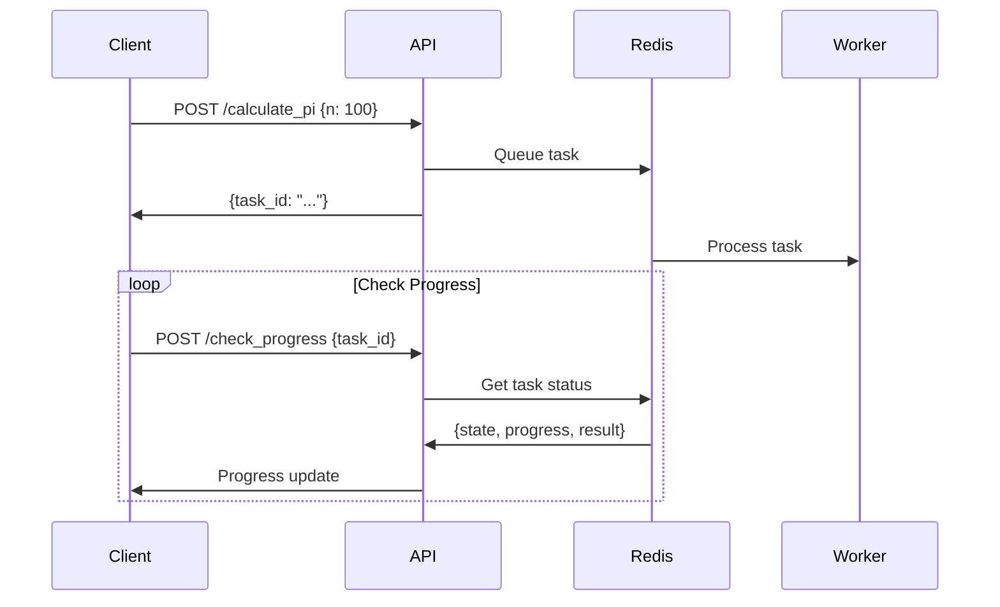

# Calculate π App

[](https://github.com/axelbunt54/calculate-pi-app/actions/workflows/tests.yml)
[](https://www.python.org/downloads/)
[](https://fastapi.tiangolo.com/)
[](https://docs.celeryq.dev/)
[](https://redis.io/)

An asynchronous Pi calculation service using FastAPI and Celery.  
Calculate Pi to any number of decimal places and monitor the progress in real-time.


## 📖 Original Task

> Create a small app in python that will calculate n digits of pi using Celery. It should do it in an asynchronical manner with 2 endpoints:
> 
> 1. /calculate_pi with 1 param n that specifies the number of decimals (e.g. /calculate_pi?n=123)
> 
> 2. check_progress that should return json with keys state, progress and result, where state is either PROGRESS or FINISHED, progress is a number from 0 to 1 indicating the proportion of task done, and result is null if its not calculated yet. For example:
> 
>     {“state”: “PROGRESS”, “progress”: 0.25, “result”: null}
> 
>     or
> 
>     {“state”: “FINISHED”, “progress”: 1.0, “result”: 3.14}
> 
> 
> The goal is NOT to calculate pi as effeciently as possible, so feel free to use some bizarre and fun algorithms :)
> 
> To avoid my suffering from installing dependencies, please use docker-compose which will run the whole app. Also include the API documentation in the most convenient way that you like. And use all good practices for writing the Python code that you know.


## 🚀 Quick Start Guide (Docker - No Installation Required)

### Prerequisites

- Docker and Docker Compose installed
- Ports 8000 and 6379 available

```bash
# 1. Clone and navigate to the project
git clone https://github.com/axelbunt54/calculate-pi-app.git
cd calculate-pi-app

# 2. Start all services (Redis, API, Celery Worker)
docker-compose up --build

# 3. Open app. You'll be redirected to the interactive API documentation
open http://localhost:8000
```

To stop services, press Ctrl+C, then run `docker-compose down`.


## 📝 Test the API

1. Open http://localhost:8000
2. Try the `/calculate_pi` endpoint:
   - Click "Try it out"
   - Enter `n = 50` (number of digits)
   - Click "Execute"
   - Copy the `task_id` from the response
3. Check progress with `/check_progress`:
   - Click "Try it out"
   - Paste the `task_id`
   - Click "Execute"
   - Keep clicking "Execute" to see progress updates


## 🐳 Docker Architecture

The application consists of three services:

1. **api**: FastAPI application serving HTTP endpoints
2. **redis**: Message broker and result backend
3. **worker**: Celery worker executing Pi calculation tasks




## 🛠️ Local Development Setup

**Note:** This section is for developers who want to modify the code.
If you just want to try the app, use Docker Quick Start above.

### Prerequisites

- Python 3.13+
- Redis
- [uv](https://docs.astral.sh/uv/getting-started/installation/) package manager
- [just](https://github.com/casey/just) command runner
- [pre-commit](https://pre-commit.com/#install) hooks.

### Local Installation

```bash
# Install dependencies
just install

# Start all services
just dev


# Stop and cleanup (use Ctrl+C first if dev is running)
just stop
```

> If you contribute, use `just lint` to keep things nice and clean. 🙃
> 
> To run unit testing use `just test`.
